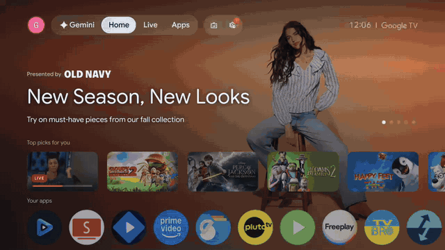
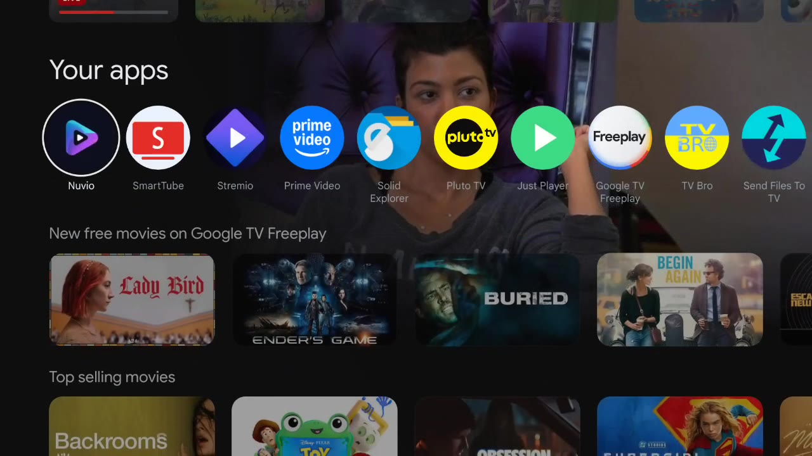
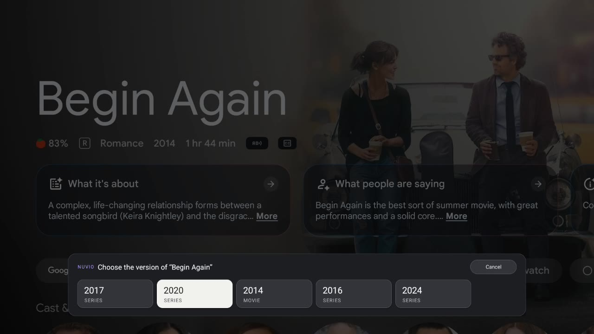
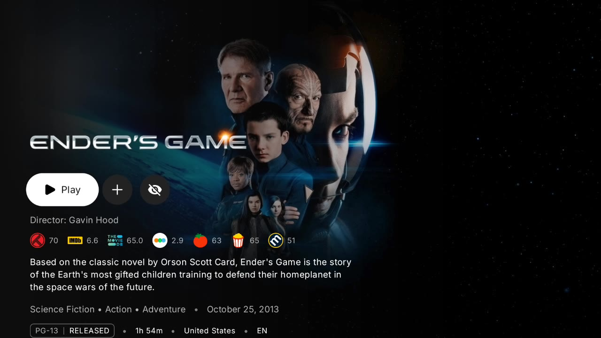

# Nuvio Recommendation Opener

Independent Android TV app that opens Google TV recommendations directly in
Nuvio. It is free and has no accounts or subscriptions.

*Just for fun.*

## Download

Download the latest signed APK from
[GitHub Releases](https://github.com/nswsys/GoogleTV-nuvio-bridge/releases/latest).

Current release:
[NuvioRecommendationOpener-v1.4.15.apk](https://github.com/nswsys/GoogleTV-nuvio-bridge/releases/download/v1.4.15/NuvioRecommendationOpener-v1.4.15.apk)

## Demo



The demo shows a recommendation opening directly in Nuvio and an ambiguous
title being resolved with the year-based match chooser.

### Screenshots

Select a movie or series from the Google TV home screen:



When several TMDB titles are plausible, choose the correct match with the TV
remote:



The selected title opens directly in Nuvio:



## Improvements

- Uses Nuvio's current TMDB deep links directly:
  `nuvio://tmdb/movie/{id}` and `nuvio://tmdb/tv/{id}`.
- Works with both known Nuvio TV package names (`com.nuvio.tv` and
  `com.nuvio.app`).
- Supports common recommendation metadata in English and Spanish.
- Recognizes single-title cards used by Browse by genre and Top free picks,
  while excluding launcher navigation, genre tiles and installed apps.
- Removes streaming-provider and Rotten Tomatoes metadata from Google TV card
  descriptions before resolving titles through TMDB.
- Preserves titles containing commas, such as `Monsters, Inc.`.
- Scores several TMDB results instead of blindly selecting the first result.
- Uses the year when the card provides one.
- Detects Google TV detail pages by their title row, year and playback actions.
- Adds a remote-friendly **Open in Nuvio** accessibility overlay when a card
  hides its title (for example, obfuscated `Column 1` free-pick cards).
- Offers a chooser for remakes or movie/series titles with multiple strong
  TMDB matches instead of silently opening the wrong result.
- When a title is ambiguous, waits for Google TV's detail metadata and uses the
  release year before opening the chooser.
- Retries detail detection while Google TV loads and places the Nuvio action
  beside the native primary action.
- Uses a rounded, focus-aware TV chooser styled to match Google TV more closely.
- Caches matches for 14 days.
- Debounces repeated clicks and discards stale network results.
- Optionally skips Google TV sponsored rows. An ad row is recognised by its
  badge, its call to action or its view id anywhere in the row — including the
  header above it — instead of requiring one exact `Sponsored` label next to one
  exact `Learn more` label, which almost never matched a real row.
- Only row-sized containers are inspected for that badge, so a sponsored row
  never makes the launcher skip the ordinary rows around it, and no more than
  four consecutive skips run before the bridge backs off.
- Leaves the row with a synthetic D-pad press on Android 13 and newer, which
  Google TV's Compose rows accept even when they reject a direct focus request;
  older releases keep the previous focus-target fallback.
- Includes a **Log ad detection** switch that writes the focused row, its view
  ids and the detector's verdict to logcat (`adb logcat -s NuvioBridgeAds:D`),
  so a device that still shows ads can be diagnosed.
- Accepts titles that collide with a genre or a provider name, such as *Max*,
  *Drama* or *Family*, when the card also exposes a year, a rating or a
  provider. Bare genre and app tiles stay excluded.
- Restricts the accessibility service to the Google TV launcher package.
- Sends no account, payment, subscription, viewing-history or device data to a
  custom backend.

## Requirements

- Google TV launcher (`com.google.android.apps.tv.launcherx`).
- Nuvio TV installed.
- Android 7.0 or newer.
- A free TMDB API v3 key.

## Configure

The easiest option is to open the installed app, enter your TMDB API v3 key and
choose **Save TMDB key**. It is stored only in the app's private local settings.

To preconfigure the key while compiling instead:

1. Copy `local.properties.example` to `local.properties`.
2. Add the key:

   ```properties
   TMDB_API_KEY=your_key_here
   ```

3. Open the project in Android Studio and build the `app` module.

Run the local unit tests with:

```bash
./gradlew test
```

The API key is compiled into the APK. Treat it as a client identifier, restrict
its use where TMDB supports it, and do not place private backend secrets in the
app.

## Install and enable

### Install directly on Google TV

1. Install Nuvio TV and open it at least once to finish its initial setup.
2. Download the signed APK from the
   [latest release](https://github.com/nswsys/GoogleTV-nuvio-bridge/releases/latest).
3. Transfer the APK to the TV with a USB drive, **Send Files to TV**,
   **Downloader**, or another file manager.
4. If prompted, allow **Install unknown apps** for the app used to open the APK.
5. Install **Nuvio Recommendation Opener**. When updating, install the new APK
   over the existing version; do not uninstall the old version first.
6. Open the bridge, enter a free TMDB API v3 key, and choose
   **Save TMDB key**.
7. Choose **Enable accessibility service**, find
   **Nuvio Recommendation Opener**, and turn it on.
8. If Google TV blocks the service, open the bridge's app-info screen, choose
   **Allow restricted settings**, and then enable the accessibility service
   again. Menu names vary by device and Android version.
9. Return to the bridge and choose **Test Nuvio integration**. It should open
   *The Matrix* in Nuvio.

After setup, return to the Google TV home screen and select a movie or series.
The bridge will resolve the title and open it in Nuvio. Ambiguous titles display
a remote-friendly match chooser first.

### Install with ADB

Download the release APK to the current directory, connect to the TV, and run:

```bash
adb install -r NuvioRecommendationOpener-v1.4.15.apk
```

If Android reports that accessibility is restricted for the sideloaded app:

```bash
adb shell appops set com.nswsys.nuviobridge ACCESS_RESTRICTED_SETTINGS allow
```

Enable the service from the Google TV accessibility menu. You can verify that
it is active with:

```bash
adb shell settings get secure enabled_accessibility_services
```

The output should contain:

```text
com.nswsys.nuviobridge/com.nswsys.nuviobridge.RecommendationAccessibilityService
```

## Build from source

Building the project requires Android Studio or Gradle with JDK 17 and Android
SDK 36. Configure `local.properties` as described above, then run:

```bash
./gradlew test assembleDebug
```

## Privacy

The accessibility service receives click, focus and window-content events only
from the Google TV launcher. Candidate titles are sent to TMDB for
identification. Results are stored locally for 14 days. The app has no
analytics, ads, user accounts, subscription checks or payment processing.

## Scope

This app redirects metadata cards to a third-party app. It does not host or
provide audiovisual content, streams, torrents or add-ons. It is not affiliated
with or endorsed by Google, TMDB or Nuvio.

Nuvio compatibility is based on the public deep-link interface in the official
[Nuvio TV repository](https://github.com/NuvioMedia/NuvioTV). No Nuvio source
code is included in this project.

## License

MIT. See `LICENSE`.
